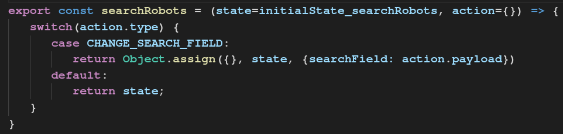
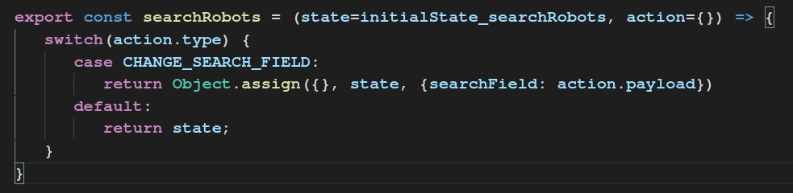

[RoboRedux demo](https://drcardamom.github.io/RoboRedux/)

[GitHub repo](https://github.com/DrCardamom/RoboRedux)

## (1) What is Redux and when to use it?
Redux manages the state, so it's userful when your application is large and you need to manage many states and share them between multiple containers.

## (2) Three Redux principles
### 1. Single source of truth - bundle state in one object ```store```
   
   You'd have one single object ```store``` that describes the entire ```state``` of the app.

### 2. ```state``` is ready only

   Instead of updating a ```state```, in Redux you create a new ```state``` every time state changes, like below

   

   This encourages immutabililty and prevents unexpected errors.

### 3. Pure functions
   Changes are taken care of by pure functions called reducers in Redux.

## (3) How Redux works 
### 1. Actions (+ middleware)
Actions such as 'click a submit button' or 'fetch API call' need to be registred as action and dispatched to be triggered.


### 2. Reducers
Reducers are pure functions that takes actions and spit out store(= ``` this.state ```). They process actions and create a new state based on them.



### 3. Store
```store``` is basically ```this.state``` in Redux. It's an object that describes state of the whole application. You pass this down to ```<App />``` as a prop.
Reducers take actions and return state, which gets passed to store.


### 4. Changes happen
Once store is updated, React detects the change(s) and updates the view layer. These 4 stages happen only from action to view layer update, which is called a uni-directional data flow.