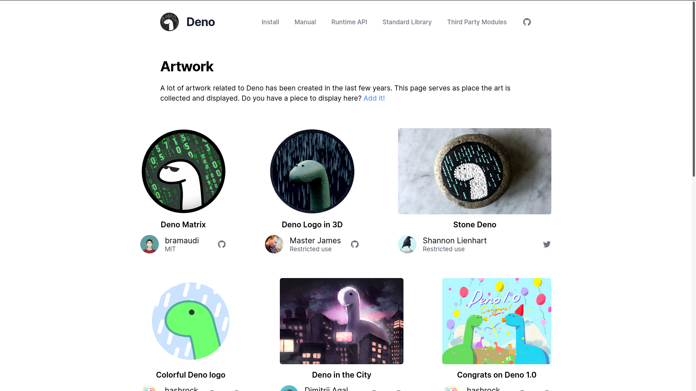

When I am working on a new tech stack or an online course, expecially in the middle of it, I try not to check tech news very much because it's easy to get fascinated by something new and start a project, but it's harder to not get distracted and actually finish what you started. I would like to use that as an excuse for my having not noticed [Deno 1.0 release](https://deno.land/v1) for A MONTH (even a little over a month).  

[What is Deno.js and why should you care?](https://dev.to/gregfletcher/what-is-deno-js-and-why-should-you-care-b26)

This is so exciting. I love the fact that Deno is an anagram of Node and the logo is a dinosaur.

I am in the middle of TypeScript revising but my next focus is most likely going to be Deno. I am not going to get into the detail of Deno too much here, but just wanted to "make noise". Tech world is aaaaaalways changing at such high speed. Hard to keep it up. I love this.