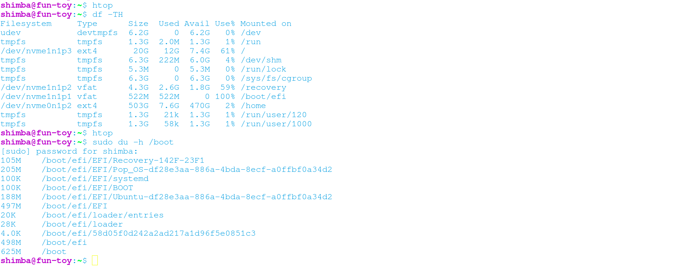
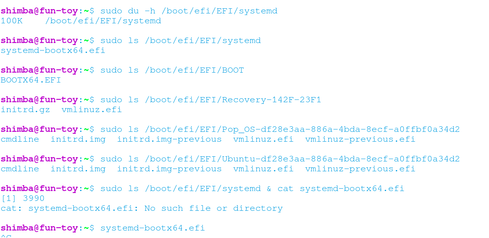
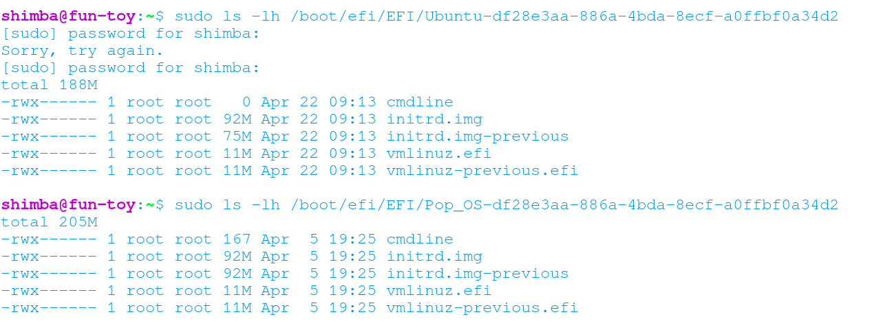
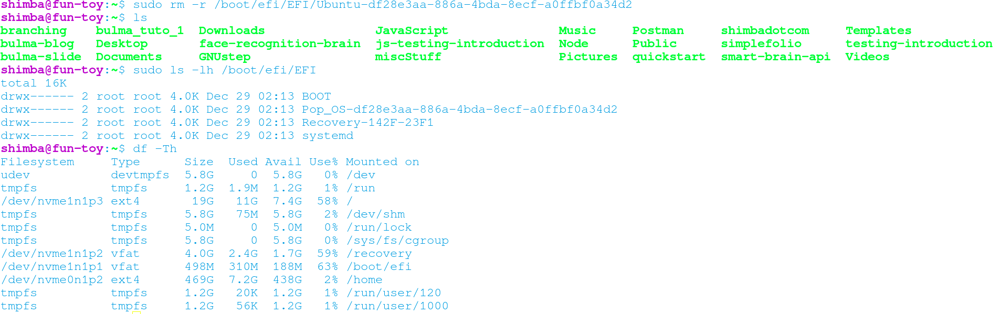

As the title says - a while ago I was doing something with my operating system Pop!OS and voila, all of a sudden my laptop threw me a pop up saying something like 'low disk capacity - /boot/efi 100% full, 0MB available'. Wow, thanks, that sounds quite alarming and not very fun. In fact, the Internet told me that /boot/efi has very much to do with rebooting and I did not want my computer to be a useless plastic brick, so intead of putting it off I decided to deal with it immediately, which did make me feel like I was finally a competent adult. 

## Contents
- How I identified the cause of the issue
- Fix
- Thoughts

## (1) How I identified the cause of the issue
First I checked what's filling up /boot/efi. So ran ```du -h``` in /boot and the result was below


At this point, I was looking for a file/system that was around 200MB because I luckily remembered that last time I had seen the disk usage situation, /boot/efi was around 60% full. As shown in the image, /boot/efi/ was 100% full of 522MB. That means whatever used to not exist in /boot/efi is likely to be 200MB(= 522MB * 0.4).

So I took a look at what exactly was in each directories. 


 
Okay, the contents of ```Pop_OS-df28e3aa-886a-4bda-8ecf-a0ffbf0a34d2``` and ```Ubuntu-df28e3aa-886a-4bda-8ecf-a0ffbf0a34d2``` look... kind of the same, at least from outside. So I ran ```ls -lh``` to see if they are really the same size. 



Alright, looks like ```Ubuntu-df28e3aa-886a-4bda-8ecf-a0ffbf0a34d2``` was created almost at the same time as /boot/efi got full and it was indeed 188MB which explained my math. 

## (2) Fix

I did't need 2 pairs of ```cmdline``` ```initrd.img``` ```initrd.img-previos``` ```vmlinuz.efi``` ```vmlinuz-previous.efi``` and apparetnly those in ```Ubuntu-df28e3aa-886a-4bda-8ecf-a0ffbf0a34d2``` were missing some file contents that were in ```Pop_OS-df28e3aa-886a-4bda-8ecf-a0ffbf0a34d2```. I decided to remove the whole ```Ubuntu-df28e3aa-886a-4bda-8ecf-a0ffbf0a34d2```. 

To do so, I ran ```rm -rf Ubuntu-df28e3aa-886a-4bda-8ecf-a0ffbf0a34d2``` which cleared 37% of /boot/efi space.



Just to make sure my machine would reboot properly without the files I just had deleted, I rebooted it and it indeed did reboot. Phew!

## (5) Useful resources

These recourses helped me connect each dots of my knowledge as I am no OS expert nor a cs grad.

##### How to edit /boot/efi 
https://askubuntu.com/questions/650291/how-to-edit-boot-efi

##### What is the efi/esp partition?
https://askubuntu.com/questions/659588/what-is-the-efi-esp-partition

##### cd into directory without having permission
https://stackoverflow.com/questions/8221820/cd-into-directory-without-having-permission

##### Why doesn't `sudo cd /var/named` work?
https://askubuntu.com/questions/291666/why-doesnt-sudo-cd-var-named-work 

##### EFI Partition vs /boot partition
https://superuser.com/questions/520068/efi-partition-vs-boot-partition)

##### What is UEFI Secure Boot?
https://wiki.ubuntu.com/UEFI/SecureBoot

##### UEFI boot: how does that actually work, then?
https://www.happyassassin.net/posts/2014/01/25/uefi-boot-how-does-that-actually-work-then/

##### What are initrd.img* files?
https://www.reddit.com/r/linuxquestions/comments/e05tmf/what_are_initrdimg_files/