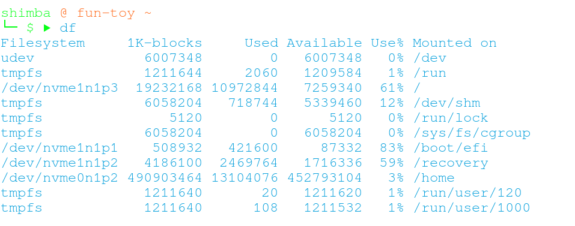
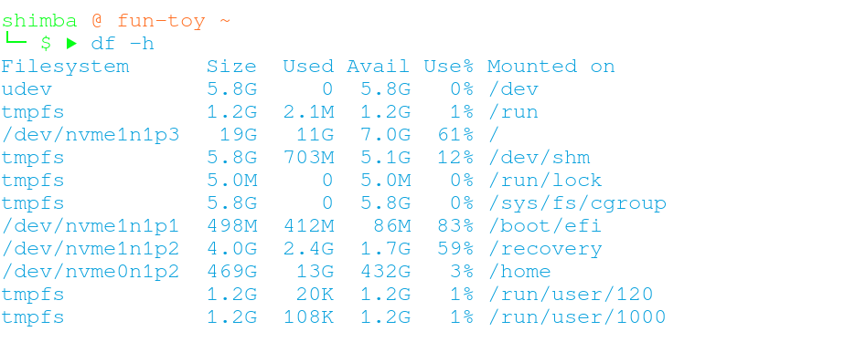
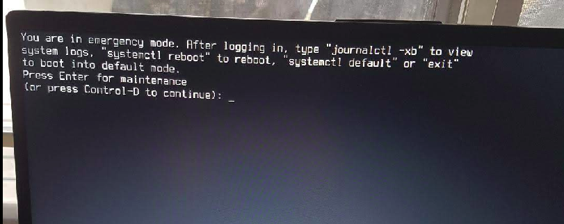

 Never did I ever think I would spill a glass of water on my precious MacBook Pro. But I did, on one of the worst day of the year; 24th December. On 25th most stores would be closed, 26th was a boxing day and most repairers would be still closed and I had something due on the 27th.

 I had no choise but to go in BestBuy <del>filled with festive muggles</del> and make a quick decision on a new laptop because Hossein, [macbook repairer I trusted](http://macplace.ca/) did say "Next time this breaks that'll be the time you need a new machine, man." Everyone else seemed so happy and excited because they were probably there to get christmas presents, whereas I was feeling so dead inside, probably was looking dead outside as well.

 Anyway, that's how I unexpectedly ended up getting myself a pricey christmas present, ASUS VivoBook, and this was the beginning of my operating system learning journey.

## Contents
- My laptop spec
- How I identified the cause of the issue
- How I re-mounted /home
- Overheat issue

## (1) My laptop spec
My laptop has hybrid memory system where it has 32GB SSD and 512GB PCIe SSD. So in total I had roughly 540GB memory space, which was obviously more than enough. If I had a ton of pictures or downloaded movies, I would've only moved those to external HDD but all I had on this machine were local directory for my JavaScript projects. And yet, my root directory said it's full already only after 3 months. I use Pop!OS only because my leptop somehow kept rejecting everything else I tired to install - Ubuntu, Linux Mint, Debian, Manjaro,CentOS. It's still a mystery till this day.

## (2) How I identified the cause of the issue
On [Ask!Ubuntu](https://askubuntu.com/questions/767267/deleting-core-dump-folders-files-in-root-partition-for-space), someone suggested this command ```sudo du -hx / | sort -h``` that shows major files, its size, and its location to see what exactly was consuming the partition mounted on /

```du``` = disk usage. Estimates file usage space

```-h``` = show output in human readable style

```|``` = pipe. Used to pipe one command to another

After running that command, it was clear that out of top 50 biggest files most of them were located in ```/home```.

And I ran another command ```df -Th``` for the first time, and I finally realized I my ```/home``` was mounted on the same partition as ```/```.

```df``` = disk free. Displays information related to file systems about total space and available space.

```-T``` = type

```-h``` = again, human readable

Just as an example, this is what output looks like if you don't have ```-h``` option


but with ```-h``` option


Now that I know what's filling my /, I gotta move that elsewhere.

## (3) How I re-mounted /home
I followed [this instruction](https://help.ubuntu.com/community/Partitioning/Home/Moving) on Ubuntu documentation while referencing [this](https://www.psychocats.net/ubuntu/separatehome#troubleshooting) a bit as well.

Following these steps wasn't difficult but just thrilling and scary.

I personally thought the most imporatant part that could save you if anything goes wrong was to make sure to make a copy of fstab. As long as you have a copy of prevoious fstab, you can recreate fstab and re-do the whole process again, which is actually what I did when something went wrong after re-boot.


From command line I recovered the previous fstab and went back into my old /home and did the whole process again.

## (4) Thoughts
Although it took me 2 days to figure all this out before I actually made up my mind and move /home to another partition which put me behind my shcedule, I am happy that I got to learn all these new commands, Linux file systems and memory allocation system. This is something I probably wouldn't have to deal with if I was still a mac user, but this is what I wanted when decided to not buy another MacBook and experiment with Linux distros. I know my learning style is through actual trouble shooting than just reading documentations so this was a great excercise. 

My mentor [Ivan](https://www.linkedin.com/in/ivan-malone-52191011b/) would often say "You can be a okay developer without knowing well about operating systems and computers, but if you want to be a really good one, you gotta know what's going on under the hood". 