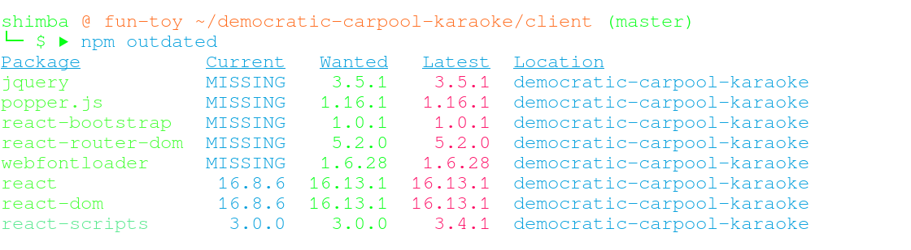

I have a confession: I did not know how to update npm dependencies until today. I know, it's shameful. But the good news is now I do! 

I wanted to improve [Democratic Carpool Karaoke](https://democratic-carpool-karaoke.herokuapp.com/) but alas, some of depencies were a bit too old so I looked up how to <del>pretend everything is okay when it's not</del> how to upgrade npm dependencies. I'd like to leave some memos for my future self.

## Contents
+ 
+ 
+ 

## (1) How to read npm version - Major.Minor.Patch
Example: ```v17.11.5```
(Major).(Minor).(Patch)

Major - this number is incremented when breaking changes are made

Minor - this number is incremented when they fix bugs and it won't break consuming code

Patch - this number is incremented when they fix bugs and it won't break consuming code
 
https://semver.org/

## (2) Those intimidating ```^``` and ```~```
``` ^ ``` means the latest **minor** verion can be install safely.
``` ^ 17.5.4 ```  means it can be safely installed if it's the newest version in ```17.x.x```

``` ~ ``` means the latest **patch** verion can be install safely.
``` ^ 17.5.4 ```  means it can be safely installed if it's the newest version in ```17.5.x```

## (3) ``` npm install ``` doesn't necesarily do all the job for you

``` npm install ``` will install the latest version of dependencies only if
- they don't exist in the ```node_modules``` folder, and 
- there is no ```package-lock.json``` file.

However, ``` npm install ``` will NOT update the dependencies if
- the packages have already been installed into ```node_modules``` folder

and ```npm install``` will install the exact dependency versions specified in ```package-lock.json``` if
- the packages haven't been installed, and
- a ```package-lock.json``` file exists

## (4) How to update all dependencies
It's actually not that hectic.
### step1. Run ```npm putdated```
then you'll get something like this


### step2. Run ``` npm update ```
this command will update all npm packages to the _wanted_ version.

In case you don't want to update all packages, you can specify package names like 
``` npm update "react" "react-dom"```

## (5) How to update dependencies with major changes
### Manual way
If you don't think updating packages will break your app, dun
``` npm install PACKAGENAME_0@LATEST_VERSION PACKAGENAME_1@LATEST_VERSION ```


### Use ```npm-check-updates``` 
Alternatively, you can also run ```npx npm-check-updates -u```

This will update the dependencies to the latest version (including major version changes) in the ```package.json``` file. If you want to go ahead with the upgrades, then run ```npm install ```.

This will then upgrade the packages in the ```node_module``` folder, and the ```package-lock.json``` file will be updated as well.